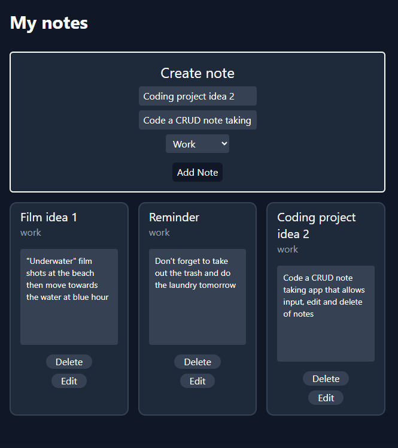

# Notes App

A CRUD note-taking app built with React, TypeScript, and Tailwind CSS. Notes persist across
all sessions using localStorage



## Features

- Create notes with a title, body, and category     (Work, Education, Coding)
- Edit notes in place with pre-filled inputs
- Delete notes
- Notes persist on page refresh using localStorage
- Form validation so empty fields cannot be submitted

## Tech Stack

- React 19
- TypeScript
- Tailwind CSS
- Vite

## Getting Started

```bash
git clone https://github.com/vclaudio11/notes-app.git
cd notes-app
npm install
npm run dev
```

## Project Structure

```
src/
├── components/
│   ├── NoteCard.tsx    # Displays a single note with edit and delete
│   └── NoteForm.tsx    # Form for creating new notes
├── types.ts            # Shared Note interface and NoteType union
└── App.tsx             # Root component — owns all state
```

## Concepts Practised

- `useState` for form and edit state management
- `useEffect` for localStorage persistence
- Props and callback props (`onAdd`, `onEdit`, `onDelete`)
- Conditional rendering for edit mode
- Lazy state initialiser for reading localStorage   on mount
- `crypto.randomUUID()` for unique note IDs
- TypeScript interfaces and union types

## Roadmap

-[ ] create a dedicated editing page for each note
-[ ] allow notes to hold documents relating to the note
-[ ] allow notes to be placed in folders 
-[ ] allows you to choose which notes you want to convert to .md to store directly in your obsidian